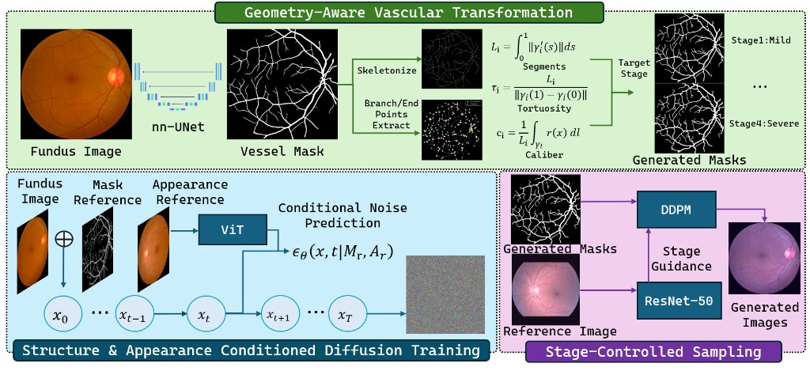
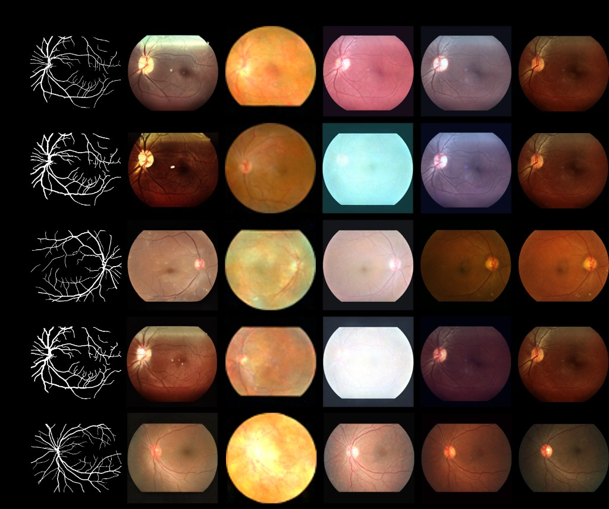

# Stage-Aware Retinal Image Generation

This repository contains code for a three-stage pipeline: vessel segmentation and geometry, mask-conditioned diffusion training, and stage-guided image sampling.

## Overview



## What the code does

### Stage 1 — Vessel segmentation and geometry-based masks

- **nnUNet**  
  Converts retinal images and masks to nnUNet format, trains 2D segmentation models, and runs inference to obtain vessel masks. Scripts: `convert_retinal_fundus_to_nnunet.py`, `train_*.sh`, `test_*.sh`; see `nnUNet/CONVERT_README.md`.

- **Vessel geometry**  
  Reads vessel masks, skeletonizes them, and computes segment length, tortuosity, and caliber. Can export masks for the diffusion stage. Code: `main/vessel/skeleton_utils.py`, `path_utils.py`, `metrics.py`, `tortuosity_control.py`, `width_control.py`, `export_masks_for_diffusion.py`.

- **Stage-specific mask generation**  
  Builds target-severity (e.g. mild vs severe) masks from geometry and a stage recommender. Code: `main/mask_generation/mask_generator.py`, `stage_recommender.py`, `generate_4levels_*.py`.

### Stage 2 — Mask-conditioned diffusion training

- **Segmentation-guided diffusion**  
  Trains a DDPM/DDIM model conditioned on structure (segmentation mask) and optionally on an appearance reference. Entry: `segmentation-guided-diffusion/main.py` (train/eval); training and pipeline logic in `training.py` and `eval.py`. Data layout: image + mask (and optionally same-label reference) per sample.

### Stage 3 — Stage-guided sampling

- **Sampling from masks**  
  Loads the trained diffusion checkpoint and generates images from Stage-1 masks (and optional reference). Script: `segmentation-guided-diffusion/run_generate_from_masks.py`; uses `eval.py` pipelines.

- **Classifier guidance**  
  A ResNet-50 DR stage classifier (0–4) is used to steer the denoising process toward a target stage. Classifier code and training: `classify/DR/` (e.g. `train.py`, `config.py`, `dataset.py`). Guidance is applied during sampling so that the generated image matches the given mask and reference while moving toward the chosen stage.

## Representative results



---

## Repository layout

```
nnUNet/                    # Vessel segmentation (nnUNetv2, convert, train, test)
main/
  vessel/                  # Skeleton, tortuosity, caliber, mask export
  mask_generation/         # Stage-specific mask generation
segmentation-guided-diffusion/   # Diffusion train/eval and sampling from masks
classify/DR/               # ResNet-50 stage classifier and training
docs/                      # Optional method notes
```

---

## How to run (by stage)

- **Stage 1**  
  Convert data and train/test segmentation (see `nnUNet/readme.md`, `nnUNet/CONVERT_README.md`). Run vessel geometry and mask generation from `main/vessel/` and `main/mask_generation/` (see `main/vessel/README.md`, `main/mask_generation/example_usage.py`).

- **Stage 2**  
  Prepare image + mask (and optional ref) data; train from `segmentation-guided-diffusion/`:
  ```bash
  cd segmentation-guided-diffusion
  python main.py --mode train ...
  ```
  See `segmentation-guided-diffusion/README.md` for options.

- **Stage 3**  
  Generate images from Stage-1 masks using the Stage-2 checkpoint:
  ```bash
  cd segmentation-guided-diffusion
  python run_generate_from_masks.py --ckpt_dir <ckpt> --mask_dir <mask_dir> ...
  ```
  Classifier weights live in `classify/DR/`; guidance is applied inside the sampling code.

---

## Dependencies

- **Stage 1:** PyTorch, nnUNetv2, standard image I/O; see `nnUNet/` and `main/vessel/` for scripts and any extra deps.
- **Stage 2:** `diffusers`, `torch`, `datasets`; see `segmentation-guided-diffusion/README.md`.
- **Stage 3:** Same as Stage 2; classifier in `classify/DR/` (ResNet-50, PyTorch).

See `requirements.txt` for a minimal list.
